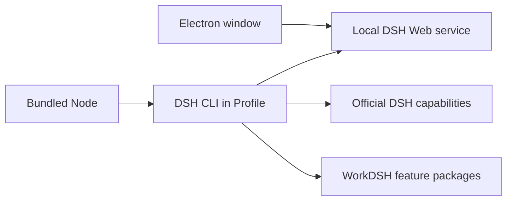

# WorkDSH Desktop architecture

[中文](architecture.md)

WorkDSH Desktop is an Electron carrier for one pinned DeepSeek Harness Profile. `apps/desktop/src/workdsh-main.ts` is the installer's only application entry point. Official DSH is consumed as version-locked published packages. Bundled interpreters, Office assets and command helpers come from checksum-verified official Desktop releases; no official source checkout is required. The bundled `workdsh-runtime/profiles/workdsh` provides the DSH Host, Web UI, and WorkDSH feature packages.

The current development launcher materializes an independent writable Profile under application data. The official installation anchor supplies default dependencies; member-installed dependencies belong to their Profile, without linking the whole bundled dependency tree. Bundled Node starts the same official Host through its `runProfile` API with the writable Profile and complete installation anchor; explicit plugin operations use official `runCli` and the primary runtime's pnpm CLI. Once DSH is ready, the window loads its local token URL. Closing the Windows window exits and stops the child process; macOS follows its normal window lifecycle. See the [Desktop connection guide](DESKTOP-PERSONAL-ENTERPRISE.md) for personal and enterprise use. Window behavior, member sync and real platform installation require separate acceptance.

The default WorkDSH features are only library, experts, skills and MCP/connectors; audit, access, local identity and browser sessions are required infrastructure. The enterprise account plugin ships with the runtime and activates only after enterprise login; projects, WorkDSH Office, activity, collaboration and notifications are explicitly installed external plugins. None is a second Desktop or a second DSH installation inside Electron. SkillHub and dshmarket are third-party catalog integrations in the same Profile; their catalog entries are not all preinstalled or reviewed by WorkDSH.

`upstream.json` records the sole upstream commit and version. The carrier has no direct DSH npm dependency. Packaging scripts use that version to prepare and verify the Profile, official primary runtime, and installer. The installed `app.asar` contains only the Electron entry point, without a second `node_modules`. An upgrade updates the upstream pin, compatible WorkDSH Profile, and bundled resources, then runs `corepack yarn check`, platform packaging checks, and installed-app startup validation. The default target is the latest official stable release; pre-releases require an explicit decision.

See [ownership boundaries](desktop-boundaries.md) and the [package build guide](../apps/desktop/README.md).
