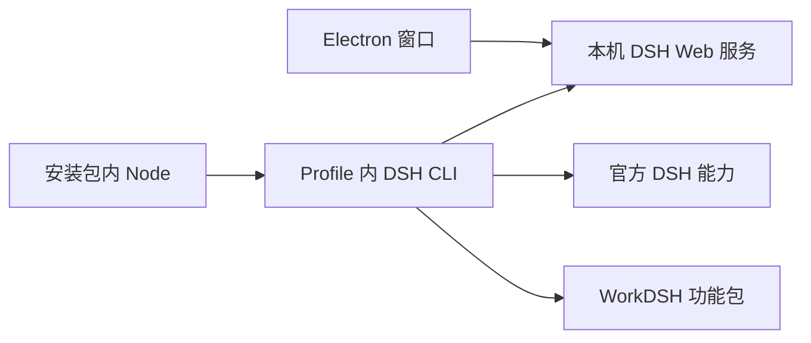

# WorkDSH Desktop 架构

[English](architecture.en.md)

WorkDSH Desktop 是一个 Electron 外壳，运行一套固定版本的 DeepSeek Harness Profile。`apps/desktop/src/workdsh-main.ts` 是安装包唯一的应用入口；官方 DSH 使用锁定版本的已发布包；解释器、Office 资源和命令管理程序从校验过的官方 Desktop 发布包提取，构建无需官方源码。安装包中的 `workdsh-runtime/profiles/workdsh` 提供 DSH Host、Web UI 和 WorkDSH 功能包。

当前开发态启动器在应用数据目录创建独立可写 Profile；官方安装锚点供应默认依赖，成员本地安装的依赖由自己的 Profile 管理，不链接整个安装包依赖树。安装包内的 Node 通过官方 `runProfile` 接口启动同一 Host，并传入可写 Profile 与完整安装锚点；显式插件操作通过官方 `runCli` 和主运行时的 pnpm CLI 执行。DSH 就绪后，窗口加载服务输出的本机 token URL。关闭 Windows 窗口会退出并终止子进程；macOS 遵循系统窗口生命周期。个人与企业连接方式见[Desktop 使用说明](DESKTOP-PERSONAL-ENTERPRISE.md)。图形交互、成员同步和真实平台安装需要单独验收。

默认 WorkDSH 功能仅为资料库、专家、技能和 MCP/连接器；审计、访问控制、本地身份与浏览器会话是必要基础依赖。企业账号插件随包供应，仅企业登录后启用；项目、WorkDSH Office、活动、协作和通知等功能为显式安装的外部插件。它们都不是第二个 Desktop，也不在 Electron 外壳内另装一套 DSH。SkillHub 与 dshmarket 是同一 Profile 内的第三方目录集成，不代表其目录内容全部预装或经 WorkDSH 审核。

`upstream.json` 记录唯一的上游提交和版本。外壳不直接依赖 DSH npm 包。打包脚本读取该版本来准备和验证 Profile、官方主运行时与安装包；安装后的 `app.asar` 只含 Electron 入口，不含第二个 `node_modules`。升级时依次更新上游固定提交、WorkDSH Profile 兼容版本和打包资源，并通过 `corepack yarn check`、平台打包检查及安装包启动验证。默认采用上游最新正式版，预发布版本需要明确选择。

参见[归属约束](desktop-boundaries.md)与[包级构建说明](../apps/desktop/README.zh.md)。
